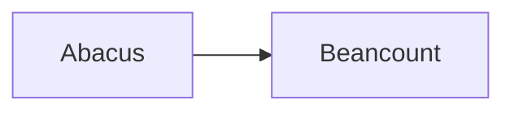

# Miniflux Epub maker

*Makes an epub of your unread Miniflux entries*

----

Having a minimal RSS reader is great and all, but sometimes you just want to
take your reading material offline with you. That's what this tool is for.

## Installation

```
go get github.com/lucaswilric/miniflux-epub
```

## Config

Your config will live at `~/.miniflux-epub.toml`, and it'll look something like
this:

```
Username = "your Miniflux username"
Password = "your Miniflux password"
```

I know, it sucks to save your password in the clear. I've been working on this
for about 3 hours so far, so cut me some slack :P

miniflux-epub will try to talk to `reader.miniflux.app` by default, but if you
self-host, you can configure the URL in the config file, e.g.:

```
MinifluxUrl = "https://example.com/miniflux"
```

## Usage

```
miniflux-epub [--outputfile=filename.epub]
```

## TODO

* Get the password in a less sucky way
* Make config file location more flexible
* Possibly some styling or something?
* Break up God function
* Find image tags and pull the referenced images into the epub
* Maybe be a bit less naive about the HTML Miniflux hands down, and its
  suitability for use in an epub?
* Mark downloaded entries as read (maybe configurably?)
* Store last downloaded entry, and only grab newer entries next time



